# MICROs to DOCKER


## Alcance

_Migración de una arquitectura de microservicios Java a Docker. El objetivo es reemplazar las máquinas virtuales actuales por contenedores._

## Cómo levantar el ambiente

Parado en la carpeta **appTest**, ejecutar `docker compose up -d`. Para bajarlo, `docker compose down`.

## Estructura de archivos

Cada componente tiene su propia carpeta con un **Dockerfile** y su archivo de configuración. El **docker-compose.yml** está en la raíz y orquesta todos los servicios.

## Volúmenes

Los archivos de configuración se montan como bind mounts. Los datos persistentes se almacenan en named volumes administrados por Docker.

---

## HAProxy

Se crearon dos instancias de HAProxy basadas en la imagen **haproxy:2.8**. Cada una tiene su propio Dockerfile y archivo haproxy.cfg montado via bind mount.

**haproxy1-ssl**: recibe el tráfico externo en el puerto **443** y lo reenvía al HAProxy interno.

**haproxy1-int**: recibe el tráfico del SSL por el puerto **80** y lo balancea entre los servicios Nginx usando round robin.

**ngx1 y ngx2**: contenedores nginx que simulan los servicios Java reales, accesibles solo dentro de la red interna de Docker. Exponen el endpoint `/stub_status` mediante un archivo de configuración montado como bind mount desde `./nginx/default.conf`.

```nginx
server {
    listen 80;

    location /stub_status {
        stub_status;
    }
}
```

---

## Redis cluster

Se configuró un cluster de Redis compuesto por tres servicios:

**redis-master**: imagen **redis:8.2.5-alpine**, configurado con autenticación, persistencia RDB en named volume **redis-master** y bind en **0.0.0.0:6379**.

**redis-slave**: imagen **redis:8.2.5-alpine**, replica al master via directiva `replicaof redis-master 6379`, persistencia RDB en named volume **redis-slave**.

**redis-sentinel**: imagen **bitnami/redis-sentinel:latest**. Se descartó usar **redis:8.2.5-alpine** con **sentinel.conf** debido a un bug en Redis 8 donde el hostname del master se resuelve durante la lectura del archivo de configuración, antes de que la red de Docker esté disponible. La imagen de Bitnami resuelve esto configurando el sentinel via variables de entorno. El sentinel monitorea al master bajo el alias `mymaster` y tiene configurado `depends_on` con `condition: service_healthy` para garantizar que master y slave estén listos antes de arrancar.

---

## Solr

Se agregó el servicio Solr basado en la imagen **solr:9.10.1**. Se eligió esta versión por sobre la 10.0.0 siguiendo el criterio de no migrar y actualizar simultáneamente.

El servicio expone el puerto **8983** hacia la máquina host, donde está disponible la interfaz de administración web. Los datos se persisten en un named volume montado en **/var/solr** dentro del contenedor.

Se creó un core de prueba llamado **test** usando el comando:

```bash
docker exec -it solr solr create_core -c test
```

Se verificó que el core persiste correctamente ante reinicios del contenedor mediante `docker compose stop solr` y `docker compose start solr`.

---

## WebDAV

Servidor de archivos compartidos sobre HTTP usando Apache HTTP Server con `mod_dav`.

**Imagen base:** `httpd:2.4-alpine`  
**Puerto:** `8081→80`

**Volúmenes:**
- `webdav` → `/usr/local/apache2/htdocs/`
- `webdav-up` → `/usr/local/apache2/uploads/`

**Estructura de archivos:**
```
webdav/
    Dockerfile
    httpd.conf
    httpd-dav.conf
    user.passwd
```

**Módulos Apache habilitados en `httpd.conf`:**
```
LoadModule dav_module modules/mod_dav.so
LoadModule dav_fs_module modules/mod_dav_fs.so
LoadModule dav_lock_module modules/mod_dav_lock.so
LoadModule auth_digest_module modules/mod_auth_digest.so
LoadModule socache_dbm_module modules/mod_socache_dbm.so
```

**Notas importantes:**
- Se usa `httpd-dav.conf` para configurar el endpoint `/uploads` con autenticación Digest.
- Se requiere instalar `apr-util-dbm_gdbm` vía `apk` porque la imagen Alpine no incluye el driver DBM necesario para `DavLockDB`.
- El archivo `user.passwd` se genera con `htdigest` dentro del contenedor y se copia al proyecto.

**Cómo regenerar `user.passwd`:**
```bash
docker exec -it webdav htdigest -c /usr/local/apache2/user.passwd DAV-upload admin
docker cp webdav:/usr/local/apache2/user.passwd ./webdav/
```

**Verificar que WebDAV funciona:**
```bash
curl -v -X OPTIONS http://localhost:8081/uploads/
# Debe mostrar: PROPFIND, PROPPATCH, COPY, MOVE, LOCK, UNLOCK, DELETE

curl -v -T archivo.txt --digest -u admin:password http://localhost:8081/uploads/
# Debe responder: 201 Created
```

---

## LDAP

Servidor de directorio centralizado de usuarios basado en OpenLDAP. Permite autenticación y autorización centralizada para todos los servicios de la plataforma.

**Imagen:** `osixia/openldap:1.5.0`

No existe imagen oficial en Docker Hub para OpenLDAP. La imagen de Bitnami fue discontinuada. Se utilizó `osixia/openldap` por ser la más mantenida y documentada de la comunidad.

**Variables de entorno:**

| Variable | Descripción |
|---|---|
| `LDAP_ROOT` | Sufijo base del directorio. Ej: `dc=empresa,dc=com` |
| `LDAP_ADMIN_USERNAME` | Usuario administrador del directorio |
| `LDAP_ADMIN_PASSWORD` | Contraseña del administrador |
| `LDAP_ORGANISATION` | Nombre de la organización raíz del árbol |

**Volúmenes:**

| Nombre | Ruta en contenedor | Descripción |
|---|---|---|
| `ldap_data` | `/var/lib/ldap` | Datos del directorio LDAP |
| `ldap_config` | `/etc/ldap/slapd.d` | Configuración del servidor slapd |

No se exponen puertos al host. El servicio es accesible únicamente dentro de la red interna Docker por nombre de contenedor (`ldap`) en los puertos `389` (LDAP) y `636` (LDAPS).

**Conceptos clave:**
- **LDAP:** protocolo para acceder a directorios de usuarios organizados en forma de árbol jerárquico.
- **Sufijo base (`dc=empresa,dc=com`):** raíz del árbol LDAP. Cada `dc=` representa un nivel del dominio.
- Los datos del directorio y la configuración del servidor se persisten en volúmenes separados para facilitar backups y migraciones.

---

## Dependencias de arranque (depends_on)

Al agregar LDAP al proyecto, el orden de arranque de los contenedores cambió y comenzaron a aparecer errores de resolución de nombres en los HAProxy:

- `haproxy1-int` no podía resolver `ngx1` y `ngx2`
- `haproxy1-ssl` no podía resolver `haproxy1-int`

La causa es que HAProxy intenta resolver los nombres de los servidores backend al momento de leer la configuración. Si el contenedor destino no está listo, falla con `could not resolve address`.

**Solución:** se agregaron dependencias explícitas con `depends_on` en el docker-compose:

- `haproxy1-int` depende de `ngx1` y `ngx2` con `condition: service_started`
- `haproxy1-ssl` depende de `haproxy1-int` con `condition: service_healthy`

Para que `service_healthy` funcione, se agregó un healthcheck a `haproxy1-int` que valida la configuración con el propio binario de HAProxy:

```yaml
healthcheck:
  test: ["CMD", "haproxy", "-c", "-f", "/usr/local/etc/haproxy/haproxy.cfg"]
  interval: 5s
  timeout: 3s
  retries: 5
```

La imagen `haproxy:2.8` no incluye `wget` ni `curl`, por lo que no es posible hacer un healthcheck HTTP. Se usa el binario nativo como alternativa.

**Stats de HAProxy:** se habilitó el frontend de estadísticas en ambos HAProxy:

```
frontend stats
    bind *:8404
    stats enable
    stats uri /stats
```

`haproxy1-int` expone stats en `:8404`, `haproxy1-ssl` en `:8405` (mapeado desde el mismo puerto interno `8404`).

**Conceptos clave:**
- El orden de arranque en Docker Compose sin `depends_on` es no determinista.
- `service_started` alcanza cuando solo necesitás que el proceso haya iniciado.
- `service_healthy` requiere que el contenedor tenga un healthcheck definido y lo pase.
- Renombrar la carpeta raíz cambia el nombre de la red y el prefijo de los contenedores — los contenedores anteriores quedan huérfanos y hay que eliminarlos manualmente.

---

## Observabilidad — Prometheus

Se incorporó un stack de observabilidad compuesto por Prometheus y un exporter por cada servicio monitoreable. Prometheus funciona en modo pull — va a buscar las métricas a cada exporter en el intervalo configurado.

**Concepto clave — Exporter:** proceso intermediario que expone las métricas de un servicio en el formato que Prometheus entiende (`/metrics`). Cada tecnología tiene su propio exporter. Los exporters viven dentro de la red Docker y no exponen puertos al host.

**Pipeline general:**
```
servicio → exporter:puerto/metrics → prometheus:9090
```

### Exporters

| Contenedor | Imagen | Puerto interno | Scrape target |
|---|---|---|---|
| `ha1-int_exporter` | `quay.io/prometheus/haproxy-exporter` | `9101` | `haproxy1-int:8404/stats;csv` |
| `ha1-ssl_exporter` | `quay.io/prometheus/haproxy-exporter` | `9101` | `haproxy1-ssl:8404/stats;csv` |
| `ngx1_exporter` | `nginx/nginx-prometheus-exporter` | `9113` | `ngx1:80/stub_status` |
| `ngx2_exporter` | `nginx/nginx-prometheus-exporter` | `9113` | `ngx2:80/stub_status` |
| `redis_exporter` | `oliver006/redis_exporter` | `9121` | master / slave / sentinel |
| `solr_exporter` | `noony/prometheus-solr-exporter` | `9231` | `solr:8983` |

**Nota sobre puertos:** cada tipo de exporter tiene un puerto por defecto definido por el proyecto. Ese es el puerto donde el proceso escucha dentro del contenedor — no se elige libremente. Cuando hay múltiples instancias del mismo exporter (ej: dos HAProxy), el puerto interno es siempre el mismo; si se mapea al host, se usan puertos distintos para evitar conflictos.

**Nota sobre Redis:** la arquitectura es master/slave + sentinel, no un Redis Cluster. Se usa un único exporter con el patrón de múltiples targets en `prometheus.yml` via `/scrape` y `relabel_configs`.

**Nota sobre HAProxy exporter:** el scrape URI debe incluir `;csv` para que el exporter reciba el formato correcto. El `;` debe pasarse como lista en el compose para evitar que el shell lo interprete como separador de comandos:

```yaml
command:
  - "--haproxy.scrape-uri=http://haproxy1-int:8404/stats;csv"
```

### prometheus

**Imagen:** `prom/prometheus`  
**Puerto:** `9090→9090`

```yaml
prometheus:
  container_name: prometheus
  image: prom/prometheus
  ports:
    - "9090:9090"
  volumes:
    - "./prome/prometheus.yml:/etc/prometheus/prometheus.yml"
    - prome:/prometheus
```

**Reload en caliente:**
```bash
curl -X POST http://localhost:9090/-/reload
```

**Verificar targets:**  
`http://localhost:9090/targets`

**Notas sobre la imagen:**
- No existe Docker Official Image para Prometheus. La imagen oficial la publica el proyecto bajo la organización `prom`.
- La imagen `bitnami/prometheus` fue descontinuada.
- El path de datos es `/prometheus`.

---

## Observabilidad — Grafana

Se incorporó Grafana como capa de visualización del stack de observabilidad. Grafana no recolecta datos — los lee desde Prometheus y los presenta en dashboards.

**Imagen:** `grafana/grafana`  
**Puerto:** `3000→3000`  
**Volumen:** named volume `grafa` montado en `/var/lib/grafana` (datos internos manejados por Grafana, no requieren acceso directo desde el host).

```yaml
grafana:
  container_name: grafana
  image: grafana/grafana
  ports:
    - "3000:3000"
  volumes:
    - grafa:/var/lib/grafana
```

**Conceptos clave:**

- **Datasource:** conexión entre Grafana y la fuente de datos. En este caso: Prometheus en `http://prometheus:9090`. Los servicios se comunican por nombre dentro de la red Docker.
- **Dashboard:** pantalla compuesta por paneles. Cada panel tiene una query PromQL y un tipo de visualización.
- **Panel:** unidad mínima visual. Puede ser una línea de tiempo, gauge, tabla, número único, etc.

**Datasource configurado:**

```
Name: prometheus
URL: http://prometheus:9090
```

### Dashboards importados

Grafana permite importar dashboards de la comunidad desde [grafana.com/grafana/dashboards](https://grafana.com/grafana/dashboards) usando un ID numérico.

| Dashboard | ID | Servicio | Notas |
|---|---|---|---|
| NGINX exporter | `12708` | ngx1, ngx2 | — |
| HAProxy | `12693` | haproxy1-int, haproxy1-ssl | Variable `host` corregida |
| Redis Dashboard | `763` | redis-master, redis-slave, redis-sentinel | Requiere autenticación en exporter |
| Solr Monitoring | — | solr | Creado desde cero |

**Nota sobre el dashboard de HAProxy:** el dashboard `12693` usa una variable `host` que busca la etiqueta `instance` en la métrica `haproxy_process_nbproc`. Esta métrica no existe en el exporter legacy (`quay.io/prometheus/haproxy-exporter`). Se corrigió editando la variable desde **Settings → Variables → host** y cambiando el campo **Metric** a `haproxy_frontend_bytes_in_total`, que sí está disponible.

### Redis Exporter — configuración y fix

El exporter `oliver006/redis_exporter` requiere dos variables de entorno porque el redis-master tiene autenticación habilitada. Sin `REDIS_PASSWORD` el exporter se conecta pero recibe `NOAUTH Authentication required` y reporta `redis_up 0`.

```yaml
redis_exporter:
  container_name: redis_exporter
  image: oliver006/redis_exporter
  ports:
    - "9121:9121"
  environment:
    - REDIS_ADDR=redis://redis-master:6379
    - REDIS_PASSWORD=<password_del_master>
```

**Fixes aplicados:**
- Puerto mapeado como fijo `9121:9121` (evitar puerto efímero aleatorio como `32768`)
- `REDIS_ADDR` apunta al contenedor por nombre de servicio, no por `localhost`
- `REDIS_PASSWORD` necesario por la autenticación del cluster

### Solr Exporter — configuración y fix

La imagen `noony/prometheus-solr-exporter` usa flags con doble guión (`--`) y el address **no** debe incluir `/solr` al final — Solr 9 expone la API admin directamente en la raíz del puerto.

```yaml
solr_exporter:
  container_name: solr_exporter
  image: noony/prometheus-solr-exporter
  ports:
    - "9231:9231"
  command: ["--solr.address", "http://solr:8983"]
```

**Fixes aplicados:**
- Flag corregido de `-solr.address` (un guión, error) a `--solr.address` (doble guión)
- URL corregida de `http://solr:8983/solr` a `http://solr:8983` (sin `/solr`)

### Dashboard Solr Monitoring — creado desde cero

Dashboard construido manualmente en Grafana usando las métricas del exporter `noony/prometheus-solr-exporter`.

| Panel | Métrica | Tipo de visualización |
|---|---|---|
| JVM Heap Usage | `solr_jvm_memory_heap_usage` | Gauge |
| JVM Heap Used | `solr_jvm_memory_heap_used` | Time series |
| Threads Activos | `solr_jvm_threads_runnable_count` | Stat |
| Open File Descriptors | `solr_jvm_os_openfiledescriptorcount` | Stat |

**Recrear servicios individualmente:**
```bash
# Recrear un servicio sin bajar el stack completo
docker compose up --force-recreate <nombre_servicio>

# Limpiar contenedores huérfanos (servicios eliminados del compose)
docker compose up --remove-orphans
```

---

## Oracle Database 23ai Free

Oracle Database corre fuera de Docker en una VM dedicada con Oracle Linux 8.10. Esta decisión replica el modelo productivo real donde las bases de datos críticas no se contienen: requieren control total de recursos, operaciones de backup/recovery dedicadas y no se benefician del modelo efímero de los contenedores.

### Arquitectura de red

Se implementó una red segmentada usando VirtualBox Host-Only Network (`192.168.56.0/24`), replicando el concepto de red de servidores segregada típico de entornos corporativos. El servidor Oracle no tiene salida directa a internet — accede a repositorios de paquetes a través de la VM Ubuntu, que actúa como gateway/router mediante IP forwarding y NAT masquerading.

```
Windows host      192.168.56.1   (acceso SSH y SQL Developer)
VM Ubuntu 24      192.168.56.10  (Docker + gateway hacia internet)
VM Oracle Linux   192.168.56.20  (Oracle Database, sin internet directo)
```

**Conceptos aplicados:**
- **Segmentación de red / defensa en profundidad:** cada capa de la arquitectura vive en su propia red y solo se comunica con quien necesita. Oracle solo es alcanzable por el puerto 1521 desde la red interna.
- **IP forwarding:** permite que la VM Ubuntu reenvíe tráfico entre interfaces (`enp0s8` → `enp0s3`), funcionando como router.
- **NAT masquerading (iptables):** el tráfico que sale desde Oracle Linux hacia internet aparece con la IP de Ubuntu, no con la de Oracle.
- **IPs fijas:** en producción los servidores de base de datos nunca usan DHCP. Toda IP está asignada administrativamente y documentada.

### Configuración de red en VM Ubuntu (gateway)

Habilitar IP forwarding de forma persistente:
```bash
# /etc/sysctl.conf
net.ipv4.ip_forward=1
```

Reglas iptables para NAT masquerading:
```bash
sudo iptables -t nat -A POSTROUTING -o enp0s3 -j MASQUERADE
sudo iptables -A FORWARD -i enp0s8 -o enp0s3 -j ACCEPT
sudo iptables -A FORWARD -i enp0s3 -o enp0s8 -m state --state RELATED,ESTABLISHED -j ACCEPT
```

> **Nota:** las reglas de iptables no persisten ante reinicios por defecto. Para hacerlas persistentes usar `iptables-persistent`.

### Instalación de Oracle Linux 8.10

VM configurada en VirtualBox con los siguientes parámetros:

| Parámetro | Valor |
|---|---|
| RAM | 4096 MB |
| CPUs | 2 |
| Disco | 60 GB (VDI dinámico) |
| Red | Host-Only `192.168.56.20/24` |
| Gateway | `192.168.56.10` (VM Ubuntu) |
| DNS | `8.8.8.8`, `8.8.4.4` |
| Hostname | `oracle-db` |
| Software | Server (sin GUI) |

### Instalación de Oracle Database 23ai Free

Oracle 23ai Free reemplaza a Oracle XE como versión gratuita. Límites: 2 CPUs, 2 GB RAM para la instancia, 12 GB de datos.

**1. Preinstall package:**
```bash
dnf install -y oracle-database-preinstall-23ai
```

**2. Instalación del motor:**
```bash
dnf install -y https://download.oracle.com/otn-pub/otn_software/db-free/oracle-database-free-23ai-1.0-1.el8.x86_64.rpm
```

**3. Inicialización:**
```bash
/etc/init.d/oracle-free-23ai configure
```

**4. Variables de entorno** (`~/.bash_profile`):
```bash
export ORACLE_HOME=/opt/oracle/product/23ai/dbhomeFree
export ORACLE_SID=FREE
export PATH=$PATH:$ORACLE_HOME/bin
```

**5. Servicio y firewall:**
```bash
systemctl enable oracle-free-23ai
firewall-cmd --permanent --add-port=1521/tcp && firewall-cmd --reload
```

### Información de la instancia

| Parámetro | Valor |
|---|---|
| SID | `FREE` |
| CDB | `FREE` |
| PDB | `FREEPDB1` |
| Puerto | `1521` |

---

## Traffic Generator

Servicio dedicado a generar tráfico sostenido y variado hacia todos los componentes de la arquitectura. Su objetivo no es el stress testing sino mantener datos reales y continuos en los dashboards de Grafana para análisis posterior.

**Imagen:** Python 3.12-alpine con `requests` y `redis-py`  
**Carpeta:** `traffic-generator/`

```
traffic-generator/
    Dockerfile
    generator.py
    requirements.txt
```

El generador corre dentro de la red Docker, por lo que accede a los servicios directamente por nombre de contenedor, incluyendo aquellos sin puertos expuestos al host (redis-master, ngx1, ngx2).

### Workers por componente

| Componente | Threads | Delay base | Operaciones |
|---|---|---|---|
| HAProxy (int) | 5 | 0.3s | GET 80%, POST 15%, HEAD 5% — 10 rutas distintas, User-Agents variados |
| Redis | 4 | 0.1s | SET/GET (mix hits+misses), INCR, LPUSH, HSET, EXPIRE, DEL |
| Solr | 3 | 0.5s | Queries por término, facets, indexado de docs, borrado periódico |
| WebDAV | 2 | 1.0s | PUT, GET, DELETE, PROPFIND — pool de hasta 50 archivos activos |

El delay incluye variación aleatoria de ±40% para evitar tráfico perfectamente uniforme.

### Comportamiento

- Corre indefinidamente mientras el contenedor esté activo (`while True` por worker).
- Loguea un resumen de operaciones ok/err cada 15 segundos.
- Espera 20 segundos al arrancar (`STARTUP_WAIT`) para que los demás servicios estén listos.
- Se reinicia automáticamente ante reinicios del host (`restart: unless-stopped`).

### Control

```bash
# Levantar solo el generador (sin bajar el stack)
docker compose up -d --build traffic-generator

# Ver logs en tiempo real
docker logs -f traffic-generator

# Pausar sin eliminar
docker stop traffic-generator

# Reanudar
docker start traffic-generator
```

### depends_on

El contenedor depende de `haproxy1-int` con `condition: service_healthy` y de `redis-master` con `condition: service_healthy`, garantizando que los servicios principales estén operativos antes de empezar a generar tráfico.

---

## Registro de puertos e IPs

### VMs e infraestructura

| Host | IP | Rol |
|---|---|---|
| Windows host | `192.168.56.1` | Acceso SSH y administración |
| VM Ubuntu 24 | `192.168.0.x` (bridge, DHCP) | Docker host, internet |
| VM Ubuntu 24 | `192.168.56.10` (host-only, fija) | Gateway para Oracle |
| VM Oracle Linux 8 | `192.168.56.20` (host-only, fija) | Oracle Database 23ai Free |

### Contenedores Docker

| Contenedor | Puerto host | Puerto contenedor | Descripción |
|---|---|---|---|
| `haproxy1-ssl` | `8080` | `443` | HTTPS externo (SSL termination) |
| `haproxy1-ssl` | `8405` | `8404` | HAProxy SSL stats |
| `haproxy1-int` | `443` | `80` | Balanceo interno round-robin |
| `haproxy1-int` | `8404` | `8404` | HAProxy INT stats |
| `ngx1` | — | — | Solo red interna Docker |
| `ngx2` | — | — | Solo red interna Docker |
| `redis-master` | — | `6379` | Solo red interna Docker |
| `redis-slave` | — | `6379` | Solo red interna Docker |
| `redis-sentinel` | — | `26379` | Solo red interna Docker |
| `solr` | `8983` | `8983` | Panel admin Solr |
| `webdav` | `8081` | `80` | WebDAV HTTP |
| `ldap` | — | `389 / 636` | Solo red interna Docker |
| `ha1-int_exporter` | — | `9101` | Exporter HAProxy INT → Prometheus |
| `ha1-ssl_exporter` | — | `9101` | Exporter HAProxy SSL → Prometheus |
| `ngx1_exporter` | — | `9113` | Exporter nginx ngx1 → Prometheus |
| `ngx2_exporter` | — | `9113` | Exporter nginx ngx2 → Prometheus |
| `redis_exporter` | — | `9121` | Exporter Redis → Prometheus |
| `solr_exporter` | — | `9231` | Exporter Solr → Prometheus |
| `prometheus` | `9090` | `9090` | Recolección de métricas |
| `grafana` | `3000` | `3000` | Visualización de métricas |
| `traffic-generator` | — | — | Generador de tráfico interno |

### Servicios externos (fuera de Docker)

| Servicio | Host | Puerto | Protocolo |
|---|---|---|---|
| Oracle Database 23ai Free | `192.168.56.20` | `1521` | TCP (TNS) |

---


